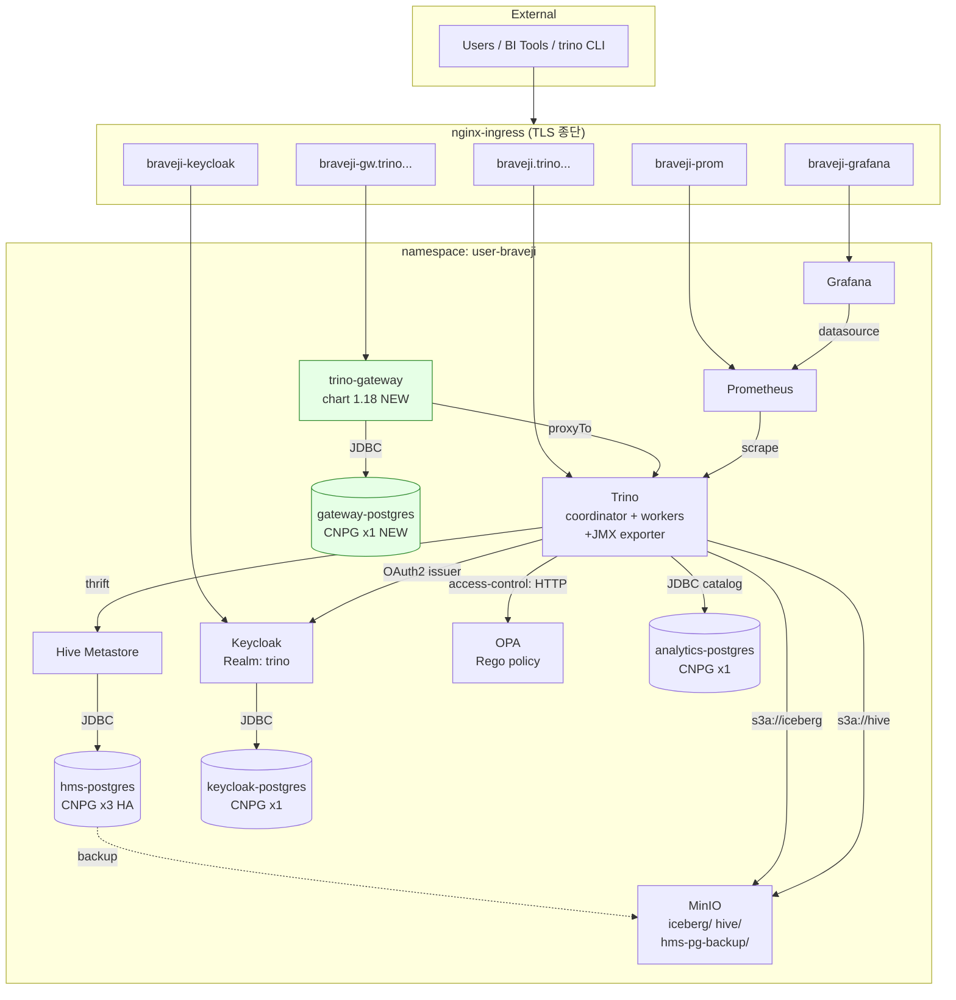

# K8s 기반 아키텍처 설계서

이 프로젝트(`user-braveji` namespace)에 배포된 Trino 데이터 플랫폼 전체 구조.
[scripts/](../scripts/)의 설치 스크립트와 [docs/01-trino-cluster-setup.md](01-trino-cluster-setup.md)
~ [docs/08-trino-gateway.md](08-trino-gateway.md) 까지의 가이드를 종합.

---

## 1. 전체 구조 (ASCII)

```
                              ┌─────────────────────────────────────────────────┐
External                      │  *.trino.quantumcns.ai  DNS 와일드카드          │
  Users  ─────────────────────►                                                 │
                              │   nginx-ingress (TLS 종단)                      │
                              └────────────────────┬────────────────────────────┘
                                                   │
   ┌───────────────────────────────────────────────┼───────────────────────────────────┐
   │                                               │                                   │
   ▼                ▼                ▼             ▼              ▼                    ▼
┌───────┐    ┌───────────┐    ┌─────────┐    ┌─────────┐    ┌─────────┐         ┌──────────┐
│braveji│    │braveji-gw │    │braveji- │    │braveji- │    │braveji- │         │ braveji- │
│ .trino│    │   .trino  │    │keycloak │    │ grafana │    │  prom   │         │  ranger  │
└───┬───┘    └─────┬─────┘    └────┬────┘    └────┬────┘    └────┬────┘         └────┬─────┘
    │              │ NEW           │              │              │                   │ legacy
    │              ▼               │              │              │                   │
    │      ┌───────────────┐       │              │              │                   │
    │      │ trino-gateway │       │              │              │                   │
    │      │  (chart 1.18) │       │              │              │                   │
    │      │  routing/LB   │       │              │              │                   │
    │      └───────┬───────┘       │              │              │                   │
    │              │ proxyTo       │              │              │                   │
    │              │ adhoc group   │              │              │                   │
    └──────────────┴───────────────┼──────────────┼──────────────┼───────────────────┼─┐
                   │               │              │              │                   │ │
                   ▼               ▼              ▼              ▼                   ▼ │
   ┌───────────────────────────────────────────────────────────────────────────────────┐│
   │  namespace: user-braveji                                                          ││
   │                                                                                   ││
   │  ┌─────────────────────────────┐   ┌──────────────┐   ┌──────────┐  ┌──────────┐ ││
   │  │  Trino  (helm: my-trino)    │   │  Keycloak    │   │ Grafana  │  │  Prom    │ ││
   │  │  ┌────────────┐  ┌────────┐ │   │  Realm:trino │   │ datasrc: │  │ scrape:  │ ││
   │  │  │coordinator │  │workers │ │   │  Client:trino│   │  prom    │  │  trino   │ ││
   │  │  │ +JMX 5556  │  │ +JMX   │ │   │              │   └──────────┘  │  job     │ ││
   │  │  └─────┬──────┘  └───┬────┘ │   │  groups:     │                 └────┬─────┘ ││
   │  │        │             │      │   │  etl/analyst │                      │       ││
   │  │   accessControl=opa  │      │   │  /bi/admin   │                      │       ││
   │  │   OAuth2 (envFrom    │      │   └──────┬───────┘                      │       ││
   │  │     trino-oauth2)    │      │          │                              │       ││
   │  └──┬─────┬─────┬───────┘      │          │   ┌──────────┐               │       ││
   │     │     │     │              │          │   │   OPA    │◄──────────────┤       ││
   │     │     │     │ HTTP /allow  │          │   │  trino   │               │       ││
   │     │     │     └──────────────┼──────────┼──►│  policy  │               │       ││
   │     │     │                    │          │   │  rego    │               │       ││
   │     │     │ thrift             │          │   └──────────┘               │       ││
   │     │     ▼                    │          │                              │       ││
   │     │  ┌────────────────┐      │          │                              │       ││
   │     │  │ Hive Metastore │      │          │                              │       ││
   │     │  │  (Deployment)  │      │          │                              │       ││
   │     │  └────────┬───────┘      │          │                              │       ││
   │     │           │ JDBC         │          │                              │       ││
   │     │           ▼              │          │ JDBC                         │       ││
   │     │  ┌──────────────────┐    │   ┌──────▼─────────┐                    │       ││
   │     │  │  hms-postgres    │    │   │keycloak-       │                    │       ││
   │     │  │  CNPG x3 HA      │    │   │postgres        │                    │       ││
   │     │  │  + ScheduledBackup│   │   │  CNPG x1       │                    │       ││
   │     │  └────┬─────────────┘    │   └────────────────┘                    │       ││
   │     │       │ S3 backup        │                                         │       ││
   │     │       ▼                  │                                         │       ││
   │     │  ┌──────────────┐ ◄──────┘  s3a://iceberg/, s3a://hive/            │       ││
   │     │  │   MinIO      │                                                  │       ││
   │     │  │  StatefulSet │                                                  │       ││
   │     │  │  buckets:    │                                                  │       ││
   │     │  │  iceberg/    │                                                  │       ││
   │     │  │  hive/       │                                                  │       ││
   │     │  │  hms-pg-     │                                                  │       ││
   │     │  │   backup/    │                                                  │       ││
   │     │  └──────────────┘                                                  │       ││
   │     │                                                                    │       ││
   │     │   ┌────────────────────┐                                           │       ││
   │     └──►│ analytics-postgres │ (catalog: postgresql)                     │       ││
   │     │   │  CNPG x1 (samples) │                                           │       ││
   │     │   └────────────────────┘                                           │       ││
   │     │                                                                    │       ││
   │     │   built-in: tpch                                                   │       ││
   │     │                                                                    │       ││
   │     └──── catalogs (Helm values, NOT mounted from catalogs/) ────────────┘       ││
   │                                                                                   ││
   │                                                                                   ││
   │   ┌──────────────────────────────────┐    ┌────────────────────────────────┐      ││
   │   │  Trino Gateway DB                │    │  Ranger Admin (legacy)         │◄─────┘│
   │   │  gateway-postgres (CNPG x1) NEW  │    │  ranger-postgres (CNPG x1)     │       │
   │   └──────────────────────────────────┘    └────────────────────────────────┘       │
   │                                                                                    │
   └────────────────────────────────────────────────────────────────────────────────────┘

  Cluster-scoped (operators / 보존 대상):
  ┌──────────────────────┐ ┌──────────────────┐ ┌─────────────────┐ ┌─────────────────────┐
  │   cert-manager       │ │   CloudNativePG  │ │  nginx-ingress  │ │  Istio mesh         │
  │   (Issuer/Cert)      │ │   (CNPG operator)│ │  controller     │ │  (sidecar 자동주입  │
  │                      │ │                  │ │                 │ │   →모든 데이터 인프라│
  │                      │ │                  │ │                 │ │   는 OFF 처리)      │
  └──────────────────────┘ └──────────────────┘ └─────────────────┘ └─────────────────────┘
```

---

## 2. 인증/인가 흐름

```
   User ──► Keycloak (Realm: trino) ──► JWT Bearer
                  │                          │
                  │ groups claim             │
                  │ (etl/analyst/bi/admin)   ▼
                  │                  Trino coordinator
                  │                  ├── OAuth2 검증 (Keycloak issuer)
                  │                  └── access-control=opa
                  │                            │ POST /v1/data/trino/allow
                  │                            ▼
                  │                          OPA
                  │                          ├── Rego policy (ConfigMap)
                  │                          └── group → catalog/schema/table 권한
                  │
                  └─ (옵션, 후속) ─► Trino Gateway OAuth 통합 →  Trino 클러스터 라우팅
```

- 사용자/그룹은 [setup-keycloak-realm.sh](../scripts/setup-keycloak-realm.sh)가 13명 자동 생성
  (etl x5 / analyst x5 / bi x2 / admin x1)
- Client Secret은 동일 스크립트가 `trino-oauth2` K8s Secret으로 자동 등록
  (helm/values.yaml `envFrom`이 참조)
- Rego 정책은 [setup-opa.sh](../scripts/setup-opa.sh)가 ConfigMap으로 적용
- 검증: [verify-opa.sh](../scripts/verify-opa.sh) — V1~V8 시나리오

---

## 3. 카탈로그 → 스토리지 매핑

| Catalog | Properties (Helm values) | Schema 저장 | 데이터 저장 |
|---|---|---|---|
| `tpch` | 내장 | — | 메모리 |
| `postgresql` | postgresql.properties | analytics-postgres | analytics-postgres |
| `iceberg` | iceberg.properties (`s3a://iceberg/`) | Hive Metastore | MinIO `iceberg/` 버킷 |
| `hive` | hive.properties (`s3a://hive/`) | Hive Metastore | MinIO `hive/` 버킷 |

> **함정**: [catalogs/](../catalogs/) 디렉터리의 파일들은 가독성용. 실제 배포는
> [helm/values.yaml](../helm/values.yaml)의 `catalogs:` 키. 카탈로그 변경 시 values.yaml을
> 수정해야 클러스터에 반영됨 (CLAUDE.md 함정 참고).

---

## 4. 설치 순서 (의존성)

```
0. CNPG operator + cert-manager + nginx-ingress (cluster-scoped, 사전 설치)
   │
1. install.sh
   ├── cert Issuer/Certificate
   ├── MinIO (HMS 백업 의존성으로 PG보다 먼저!)
   ├── hms-postgres (CNPG, x3 HA)        ← MinIO에 백업
   ├── analytics-postgres (CNPG, x1)
   ├── Hive Metastore (Deployment)
   └── helm install my-trino
   │
2. install-monitor.sh
   ├── JMX exporter ConfigMap
   ├── Prometheus 커스텀 scrape config
   ├── helm install prom (Prometheus)
   ├── helm install graf (Grafana)
   ├── monitoring Ingress
   └── docker build/push trino:480-jmx + helm upgrade my-trino
   │
3. install-keycloak-ranger.sh
   ├── keycloak-postgres (CNPG x1)
   ├── Keycloak Deployment + Ingress
   └── (legacy) ranger-postgres + ranger-admin
   │
4. setup-keycloak-realm.sh
   ├── Realm/Client/Groups/Users 13명
   └── trino-oauth2 K8s Secret 자동 생성
   │
5. setup-opa.sh
   ├── OPA policy ConfigMap (Rego)
   ├── OPA Deployment + Service
   └── helm upgrade my-trino (accessControl=opa 반영)
   │
6. (NEW) Trino Gateway 적용 — docs/08-trino-gateway.md 참고
   ├── gateway-postgres (CNPG x1)
   ├── trino-gateway-auth Secret (RSA 키쌍)
   ├── helm install trino-gateway (sidecar OFF 필수)
   └── REST API로 my-trino 백엔드 등록
```

---

## 5. Mermaid 다이어그램 (마크다운 프리뷰용)



NEW 표시(연두): 최근 작업으로 추가된 `trino-gateway` + `gateway-postgres`.
나머지는 기존 구성.

---

## 6. 주요 단일 namespace 정책

- 모든 컴포넌트가 `user-braveji` 한 namespace에 동거. 크로스-namespace 연결 없음.
- TLS 종단은 nginx-ingress에서. Trino 자체는 HTTP (`server.config.https.enabled: false`).
  대신 `http-server.process-forwarded=true` 필수 (안 그러면 406).
- **Istio sidecar 자동 주입은 모든 데이터 인프라에서 OFF**:
  - CNPG: `spec.inheritedMetadata.annotations`
  - 일반 Pod: `podAnnotations` 또는 `--overrides` 플래그
  - Trino Gateway: 빠뜨리면 ingress가 `403 RBAC: access denied`
    ([docs/08-trino-gateway.md §3-1](08-trino-gateway.md))
- 일회성 검증 Pod(`kubectl run`)도 동일 어노테이션 필요 — `setup-keycloak-realm.sh`,
  `setup-opa.sh`, `verify-opa.sh` 등이 이미 적용 중.

---

## 7. 관련 문서

- [01-trino-cluster-setup.md](01-trino-cluster-setup.md) — 1단계 클러스터 구축 + 13가지 함정
- [02-federated-query-demo.md](02-federated-query-demo.md) — 카탈로그 횡단 쿼리 데모
- [03-resource-tuning-plan.md](03-resource-tuning-plan.md) — 리소스 튜닝 (진행 중)
- [04-keycloak-oauth2.md](04-keycloak-oauth2.md) — OAuth2 통합 상세
- [05-resource-groups-quota.md](05-resource-groups-quota.md) — Resource Groups + 쿼터
- [06-opa-monitoring.md](06-opa-monitoring.md) — OPA 모니터링
- [07-operations-guide.md](07-operations-guide.md) — 운영 가이드 + 사용자 온보딩
- [08-trino-gateway.md](08-trino-gateway.md) — Trino Gateway 적용 가이드
